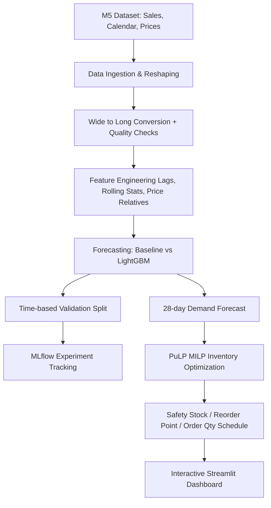

# AI-Powered Demand Forecasting & Inventory Optimization

End-to-end machine learning system that forecasts product demand on the Walmart M5 dataset and turns those forecasts into optimized inventory replenishment decisions (safety stock, reorder point, order quantity).

## Key Results

| Model | RMSE | MAE | WRMSSE |
|---|---|---|---|
| **Naive / Moving Average (Baseline)** | 2.3272 | 1.2692 | 0.9072 |
| **LightGBM Regressor** | **2.0465** | **1.1802** | **0.8734** |

- **LightGBM improved RMSE by 12.06%** over the naive moving average baseline on a 28-day holdout test evaluation.
- **Inventory optimization reduced estimated holding costs by 76.98%** and yielded a **24.10% total inventory cost saving** versus a static reorder policy.
- Automated ETL pipeline processes time-series records across 30,490 item-store series in **< 6 minutes**.

---

## Problem Statement

Too much inventory raises holding cost, storage cost, and obsolescence risk. Too little causes stockouts, lost sales, and poor customer experience. This project tackles both sides in two stages:

1. **Demand forecasting**: Predict 28-day demand per item-store using daily sales history, sell prices, calendar events, and SNAP program flags.
2. **Inventory optimization**: Convert forecasts into replenishment decisions under lead time, holding, ordering, and capacity constraints using Mixed Integer Linear Programming (MILP).

---

## Architecture & Workflow



---

## Tech Stack

| Layer | Tools & Libraries |
|---|---|
| **Data Engineering** | Pandas, PyArrow, PySpark |
| **Modeling** | LightGBM, scikit-learn, NumPy |
| **Experiment Tracking** | MLflow |
| **Optimization** | PuLP (CBC Solver) |
| **Dashboard** | Streamlit, Plotly |

---

## Methodology

### 1. Data Engineering
- **Source**: Walmart M5 Forecasting - Accuracy (3 states, 10 stores, 3,049 products, ~1,900 days).
- Reshaped sales from wide time-series format (`d_1` to `d_1941`) to long time-series format and joined calendar and price tables.
- **Data Quality Checks**: Handled missing prices (forward fill + item mean backfill), zero-sales periods, and extreme outliers.

### 2. Feature Engineering
- **Temporal & Calendar**: Day of week, day of month, week of year, is_weekend, event flags (`event_name_1`, `event_type_1`), SNAP flags per state (`snap_CA`, `snap_TX`, `snap_WI`).
- **Demand Lags**: Historical sales lags (`lag_7`, `lag_14`, `lag_21`, `lag_28`, `lag_35`, `lag_42`).
- **Rolling Statistics**: Rolling mean, standard deviation, max, and min over 7, 14, and 28-day windows (shifted by 28 days to eliminate holdout data leakage).
- **Price Volatility**: `sell_price`, `price_rel_mean` (`sell_price / mean_price`), and price discount ratios.

### 3. Demand Forecasting
- **Baseline Model**: Naive Moving Average (28-day rolling average).
- **Model**: LightGBM Regressor, chosen for high efficiency on tabular time-series features.
- **Validation**: Time-based holdout split (last 28 days `d_1914` to `d_1941`), preserving temporal order without random shuffling.
- **Tracking**: Parameters, metrics (RMSE, MAE, WRMSSE), and model artifacts logged in MLflow.
- **Top Features**: `item_id`, `lag_7`, `lag_14`, `week_of_year`, `wday`, `rolling_mean_28`.

### 4. Inventory Optimization (PuLP MILP)

| Component | Definition |
|---|---|
| **Decision Variable** | Order quantity $Q_{i,t} \ge 0$ per item per day |
| **Objective** | Minimize Total Cost = Holding Cost + Ordering Cost + Stockout Penalty |
| **Constraints** | Inventory Balance $I_t = I_{t-1} + Q_{t-L} - D_t + S_t$, Storage Capacity, Budget |

#### Inventory Policy Formulas:
$$\text{Safety Stock } (SS) = z \times \sigma_{\text{demand}} \times \sqrt{\text{lead\_time}}$$
$$\text{Reorder Point } (ROP) = \text{avg\_daily\_demand} \times \text{lead\_time} + SS$$

- **Assumptions**: Lead time $L = 7$ days, service level = 95% ($z = 1.645$), holding cost $H = \$0.50$/unit/day, ordering cost $S = \$25.00$/order, stockout penalty $p = \$5.00$/unit.

---

## Project Structure

```
.
├── configs/
│   └── config.yaml               # System parameters & hyperparameters
├── data/
│   ├── raw/                      # M5 CSV files (calendar, sales, prices)
│   └── processed/                # Long-format parquet & 28-day forecasts
├── notebooks/
│   ├── 01_data_understanding.ipynb
│   ├── 02_feature_engineering_modeling.ipynb
│   └── 03_inventory_optimization.ipynb
├── src/
│   ├── ingest.py                 # Data ingestion & wide-to-long transformation
│   ├── features.py               # Time-series feature engineering
│   ├── train.py                  # LightGBM training & MLflow tracking
│   └── optimize.py               # PuLP MILP inventory solver
├── models/
│   ├── lightgbm_demand_model.pkl # Saved model artifact
│   ├── metrics_summary.json      # RMSE, MAE, WRMSSE metrics
│   └── optimization_summary.json # PuLP inventory KPI summary
├── app.py                        # Streamlit dashboard app
├── dashboard/
│   └── app.py                    # Streamlit dashboard entrypoint
├── requirements.txt              # Dependency specifications
└── README.md                     # Project documentation
```

---

## Getting Started

### 1. Setup Environment
```bash
pip install -r requirements.txt
```

### 2. Execute Data & Model Pipeline
```bash
python src/ingest.py
python src/features.py
python src/train.py
python src/optimize.py
```

### 3. View MLflow Experiments (Optional)
```bash
mlflow ui
```

### 4. Launch Interactive Streamlit Dashboard
```bash
streamlit run app.py
```

---

## Limitations & Future Work

- **Hierarchical Forecasting**: Implement MinT / Reconciliation across Item, Store, Category, and State levels.
- **Probabilistic Forecasting**: Predict quantile distributions (DeepAR / Quantile LightGBM) for improved Safety Stock bounds.
- **Multi-Echelon Optimization**: Extend PuLP MILP from single store level to warehouse-to-store multi-echelon network.
- **API Deployment**: Wrap forecasting and replenishment engine in FastAPI REST endpoints.

---

## Author

**Parth Madrewar** | [LinkedIn](https://linkedin.com) | [GitHub](https://github.com)
